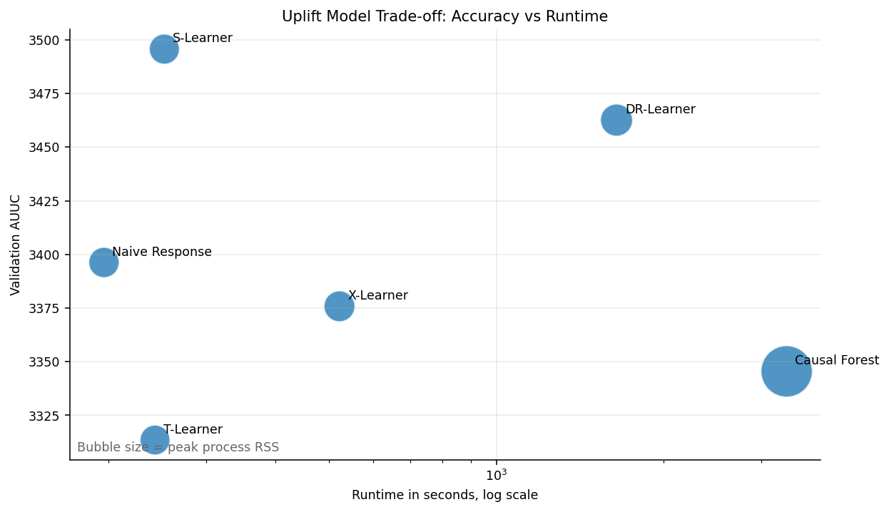
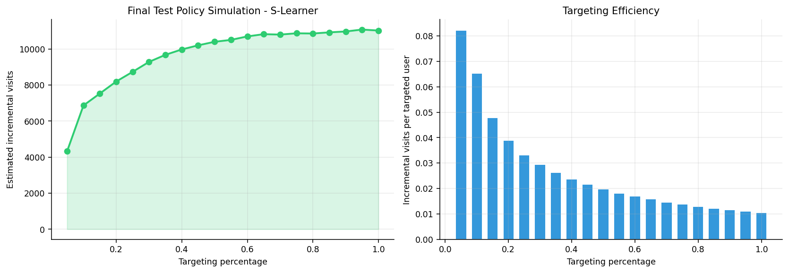
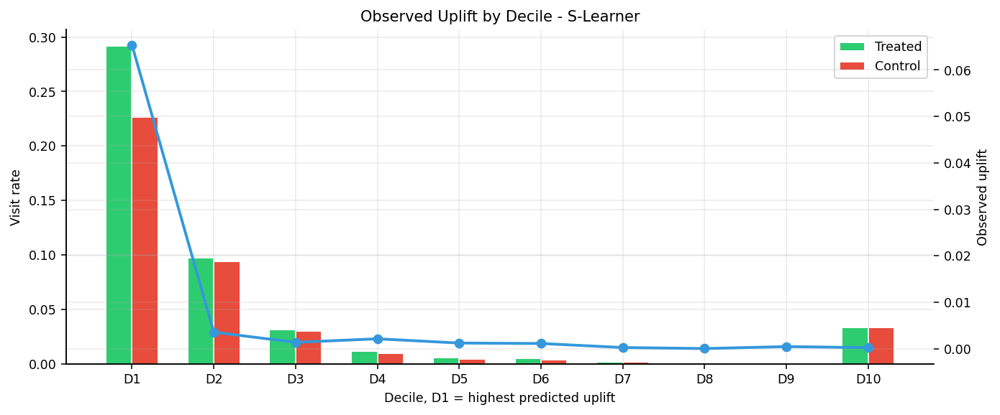
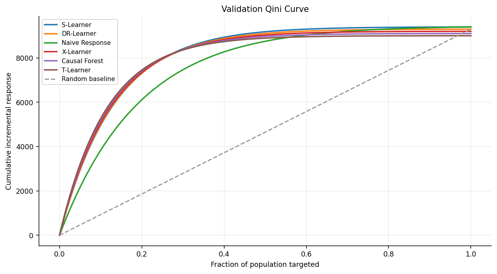
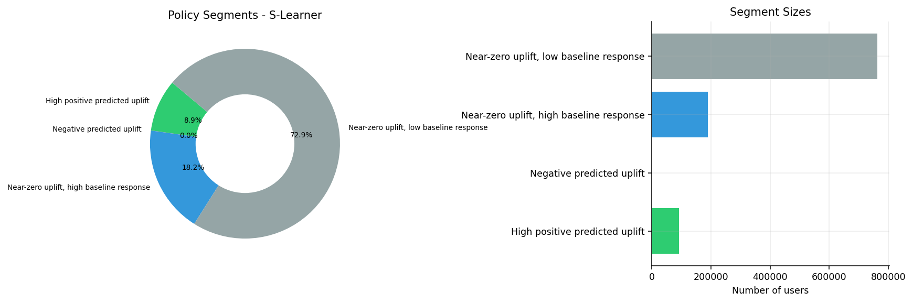
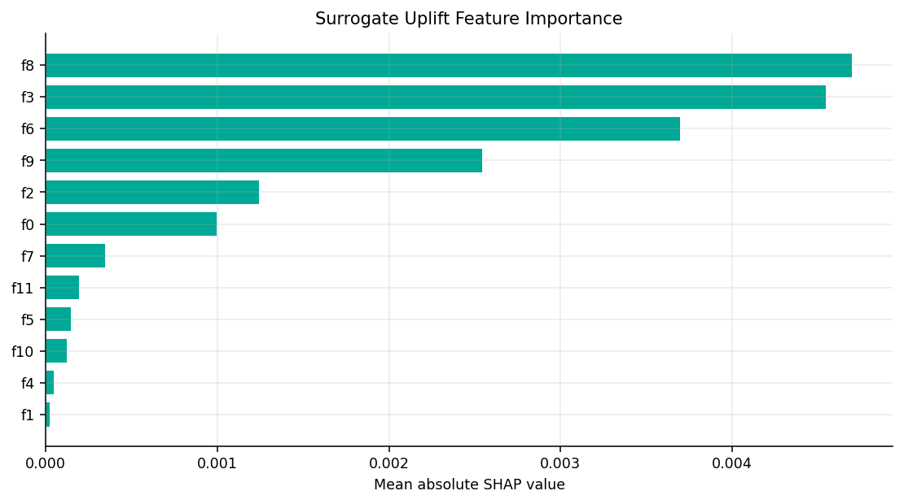
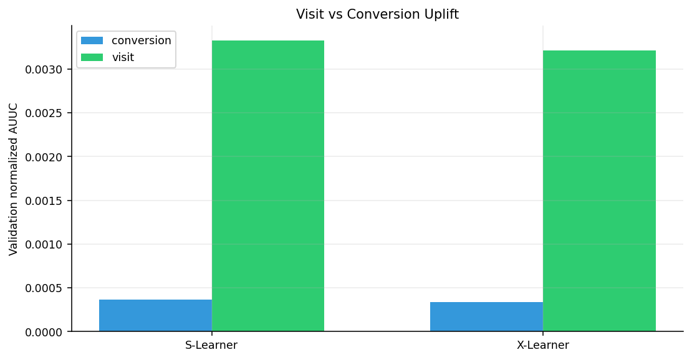

# Criteo Uplift Modeling Benchmark

**English** | [Turkish](README.tr.md)

Production-style Python project for benchmarking uplift modeling methods on the Criteo Uplift v2.1 dataset.

This repository intentionally avoids a notebook-first structure. The benchmark is split into typed Python modules with Pydantic v2 configuration, a CLI, tests, linting, Kaggle downloading, and generated README assets.

The core question is:

> Not "who is likely to convert?", but "who is likely to convert because of the campaign?"

## Highlights

- Modular `.py` implementation instead of a notebook-only benchmark
- Pydantic v2 config and result schemas
- S-Learner, T-Learner, X-Learner, DR-Learner, Causal Forest
- Naive response ranker as a policy baseline
- AUUC, Qini curve, top-decile incremental uplift
- Visit and conversion outcome support
- Runtime and sampled process RSS tracking
- Kaggle dataset downloader
- CLI through `start.py`
- Ruff linting, pytest tests, and GitHub Actions CI

## Results From the 7M-Row Run



| Model | Validation AUUC | Runtime (s) | Peak RSS (MB) |
|---|---:|---:|---:|
| S-Learner | 3495.68 | 252.3 | 5041 |
| DR-Learner | 3462.59 | 1646.7 | 5727 |
| Naive Response Ranker | 3396.22 | 196.4 | 5113 |
| X-Learner | 3375.79 | 521.7 | 5288 |
| Causal Forest | 3345.46 | 3335.2 | 14458 |
| T-Learner | 3313.44 | 242.7 | 4956 |

Final S-Learner test metrics:

| Metric | Value |
|---|---:|
| Test AUUC | 3405.48 |
| Normalized AUUC | 0.003243 |
| Top-decile uplift | 0.06538 |
| Top-decile relative uplift | 6.23x |
| Population uplift | 0.01049 |

I do not frame this as "S-Learner clearly dominates." The paired bootstrap interval for S-Learner vs DR-Learner was `[-217.63, 317.13]`, so the safer conclusion is:

> S-Learner gave the best production trade-off in this run.

## Diagnostics













## Project Structure

```text
.
├── README.md
├── README.tr.md
├── start.py
├── pyproject.toml
├── requirements.txt
├── assets/
│   ├── tradeoff_accuracy_runtime.png
│   ├── qini_curve_validation.png
│   ├── policy_simulation_test.png
│   ├── uplift_by_decile_test.png
│   ├── policy_segments.png
│   ├── surrogate_shap_uplift.png
│   └── visit_vs_conversion_uplift.png
├── src/
│   └── criteo_uplift_benchmark/
│       ├── __init__.py
│       ├── assets.py
│       ├── cli.py
│       ├── config.py
│       ├── data.py
│       ├── downloader.py
│       ├── evaluation.py
│       ├── learners.py
│       ├── metrics.py
│       ├── pipeline.py
│       ├── resources.py
│       └── schemas.py
└── tests/
    ├── test_downloader.py
    └── test_metrics.py
```

## Quickstart

```bash
python -m venv .venv
source .venv/bin/activate  # Windows: .venv\Scripts\activate
pip install -r requirements.txt
```

Generate README assets:

```bash
python start.py assets
```

Download Criteo data from Kaggle:

```bash
python start.py download --data-dir data --dataset arashnic/uplift-modeling
```

Run a fast smoke benchmark:

```bash
python start.py run --sample-size 500000
```

Run a larger benchmark:

```bash
python start.py run --full --with-dr
```

Run linting and tests:

```bash
ruff check .
pytest
```

## Pydantic v2 Config

The benchmark is configured through validated Pydantic models:

```python
from criteo_uplift_benchmark.config import BenchmarkConfig, RuntimeConfig
from criteo_uplift_benchmark.pipeline import run_benchmark

config = BenchmarkConfig(
    runtime=RuntimeConfig(
        sample_size=500_000,
        run_dr_learner=False,
        run_causal_forest=False,
    )
)

result = run_benchmark(config)
print(result.winner)
```

## Kaggle Credentials

The downloader expects one of these:

- `KAGGLE_USERNAME` and `KAGGLE_KEY` environment variables
- `~/.kaggle/kaggle.json`

Default dataset slug:

```text
arashnic/uplift-modeling
```

Alternative:

```bash
python start.py download --dataset evgeniypolin/criteo-uplift-v2-1 --data-dir data
```

## Stack

Python, Pydantic v2, Polars, pandas, NumPy, LightGBM, scikit-learn, EconML, SHAP, psutil, matplotlib, seaborn, pytest, ruff.

## References

- Kunzel et al. (2019), *Metalearners for estimating heterogeneous treatment effects using machine learning*
- Radcliffe and Surry (2011), *Real-World Uplift Modelling with Significance-Based Uplift Trees*
- Kennedy (2020), *Towards optimal doubly robust estimation of heterogeneous causal effects*
- Criteo AI Lab, *A Large Scale Benchmark for Uplift Modeling*
